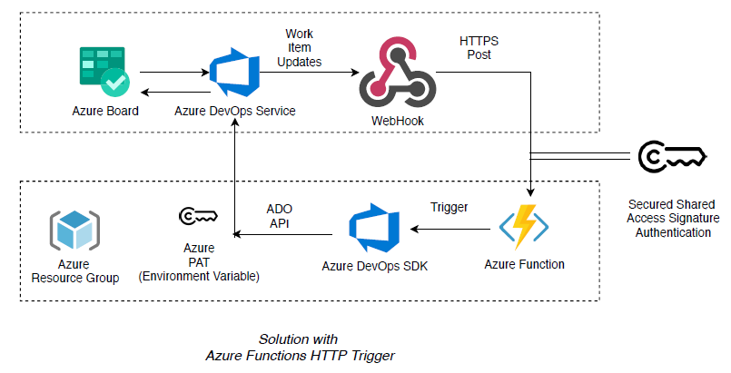
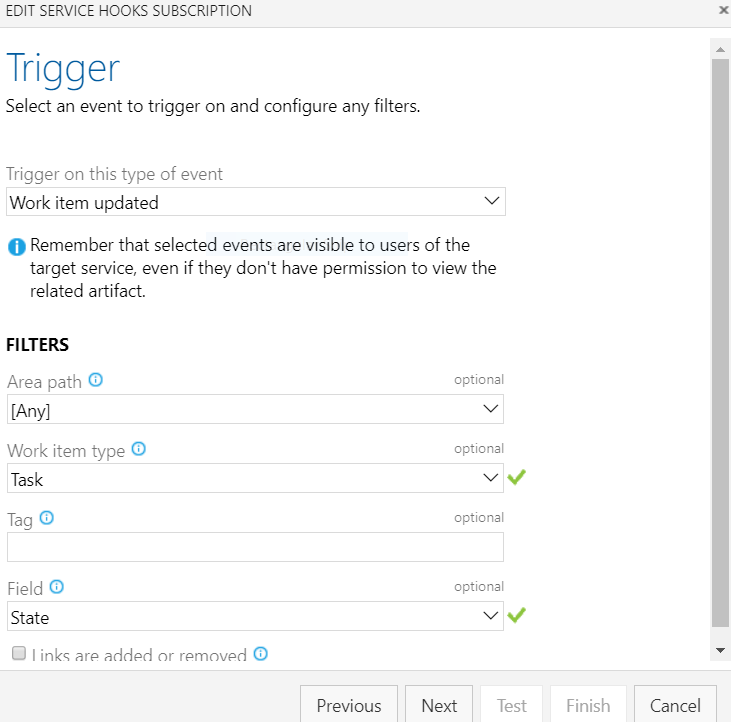
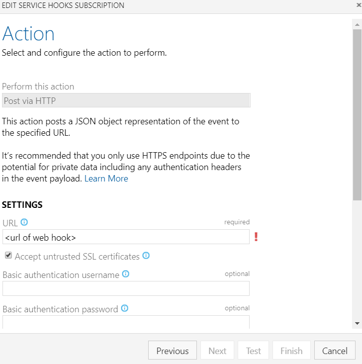
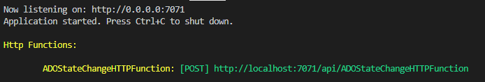

[](https://dev.azure.com/bbarman/Github-Projects-Public/_build/latest?definitionId=22&branchName=master)
[](https://sonarcloud.io/dashboard?id=bbarman.github.azdo.state.change)
[](https://sonarcloud.io/dashboard?id=bbarman.github.azdo.state.change)
[](https://sonarcloud.io/dashboard?id=bbarman.github.azdo.state.change)
[](https://sonarcloud.io/dashboard?id=bbarman.github.azdo.state.change)
[](https://sonarcloud.io/dashboard?id=bbarman.github.azdo.state.change)


# Azure Boards - Automate State Transitions (Serverless Azure Functions Version)

This project was created to help automate the updating of parent state transitions depending on the state of the child work items.

This API receives an Azure Boards work item update web hook event. The API will load the work item, check against a series of rules, and update it's parent work item accordingly.

For example, if your User Story is New and you create a task and set that task to active, the User Story should automatically be set to Active. 

Another scenario (if we chose to handle so by enabling in rules), if all child tasks are completed, automatically set the parent work item to completed as well.

## Important Updates and Changes
* This repo is enhancing the work done in following repositories 
    * [Original repo](https://github.com/microsoft/azure-boards-automate-state-transitions) from MSFT by @danhellem
    * [A forked repo](https://github.com/mstephano/azure-boards-automate-state-transitions) by another github user @mstephano
    * [Another forked repo](https://github.com/bbarman4u/azure-boards-automate-state-transitions) by me @bbarman4u
    * [Un related repo](https://github.com/CodeRunRepeat/AdoAutoStateTransitions) by another MSFT user @CodeRunRepeat

## Architecture

### Deployment with Azure Functions with HTTP Trigger
 

## How to use the project ?
### Overview

* Clone or fork this repository and define your custom rules for handling your scenarios for work item handling as per the process type that you use e.g. scrum, agile, etc. (detailed steps below)

* Create a new Azure DevOps [Personal Access Token](https://docs.microsoft.com/en-us/azure/devops/organizations/accounts/use-personal-access-tokens-to-authenticate) with "Work Items (Read, write, & manage)" permissions.

* Deploy the project as an Azure Function App with runtime stack ".NET Core 3.1 LTS" on Linux or Windows so that it is available from the Azure DevOps instance. (detailed steps below)

* Create following environment variables for the function app either in Azure Portal or through any of the CLI options -
    * ADO_PAT - To hold your Azure DevOps Personal Access Token
    * ADO_PROCESS_TYPE - To provide at run time rules of which process type to apply

* Create a new web hook for each of the child work item types. In this example we are just setting up web hooks for when Task work items are updated. The web hook should send when the state field is changed.

   

* Populate the URL field with the url of the deployed function app next and select below properties
    - Resource details to send: All
    - Messages to send: All
    - Detailed messages to send: All

    

### How to customize the rules for your specific work item type?

* Create a folder for your Process Type under the folder `rules`. In this example, we are creating rules for the process type `scrum` and placing the rule files by naming them in the format `rule.<work item type>.json`
    * Important - The work item type must match exactly the type that is being sent in the JSON request in the Azure DevOps.
    * Example - 
        - create folder `rules\scrum`
        - place rules for task as `rule.task.json`
        - place rules for bug as `rule.bug.json`
        - remember to set the environment variable `ADO_PROCESS_TYPE` as `scrum` to match the above folder name

* Update the rules in the JSON configuration file for each child work item type. You will need an entry for each state by following below conventions. [Reference for different states by Process Types](https://docs.microsoft.com/en-us/azure/devops/boards/work-items/guidance/choose-process?view=azure-devops&tabs=basic-process)

   **`ifChildStates`**: If the the work item status is this

   **`notParentStates`**: If the parent state is not one of these

   **`setParentStateTo`**: Then set the parent state to this

   **`allChildren`**: If `true`, then all child items need to be this state to update the parent

    #### Example 1 (Scrum)
    Example below from the `rules.task.json` where we want the Parent Work Item (e.g. Product Backlog Item) to be moved to
    - *`Committed`* if any of the child tasks is moved to *`In Progress`* or *`Done`* but not all tasks are *`Done`* where Parent WI is not in any of the defined states already
    - *`Done`* if all of the child tasks are *`Done`*

    ```
    {
      "type": "Task",
      "rules": [
        {
          "ifChildState": "In Progress",
          "notParentStates": [ "Committed","Done","Removed"],
          "setParentStateTo": "Committed",
          "allChildren": false
        },
        {
          "ifChildState": "Done",
          "notParentStates": ["Done","Removed"],
          "setParentStateTo": "Committed",
          "allChildren": false
        },
        {
          "ifChildState": "Done",
          "notParentStates": ["Done","Removed"],
          "setParentStateTo": "Done",
          "allChildren": true
        }
      ]
    }
    ```

    #### Example 2 (Agile)
    Example below from the `rules.task.json` where we want the Parent Work Item (e.g. User Story) to be moved to
    - *`Active`* if any of the child tasks is moved to *`Active`* where Parent WI is not in any of the defined states already
    - *`Closed`* if all of the child tasks are *`Closed`*
   
   ```
   {
     "type": "Task",
     "rules": [
        {
          "ifChildState": "Active",
          "notParentStates": [ "Active", "Resolved" ],
          "setParentStateTo": "Active",
          "allChildren": false
         },
         {
          "ifChildState": "New",
          "notParentStates": [ "Active", "Resolved", "New" ],
          "setParentStateTo": "Active",
          "allChildren": false
         },
         {
          "ifChildState": "Closed",
          "notParentStates": [],
          "setParentStateTo": "Closed",
          "allChildren": true
        }
      ]
    }
   ```

* ***Note:*** Sample Rule files have been set up in respective folders by process type, please define and use accordingly.

### Additional Security Considerations (Optional)
* Consider deploying to Azure using a CI/CD Process using Azure DevOps instead of local deployment.
* Consider securing the exposed API URL behind an Azure APIM Services that protects and authenticates the service endpoint.
* Create only Allow rules for access to the deployed API function from the public IP address of the APIM instance.
* Consider utilizing an Azure Key Vault to retrieve the Azure DevOps PAT(would require further code enhancement).

## Build and Test in Local Development Environment
### Local Environment Set Up Steps 
* Install dot net core 3.1 for your OS, [reference](https://docs.microsoft.com/en-us/dotnet/core/install/)
* Configure steps for Azure Functions local development per your IDE and OS, [reference](https://docs.microsoft.com/en-us/azure/azure-functions/functions-develop-local)
* Set the required environment variables using powershell (see example below) or using equivalent steps in a Linux Shell.
    ```
    [System.Environment]::SetEnvironmentVariable('ADO_PAT', 'my-pat-goes-here',[System.EnvironmentVariableTarget]::user)

    ```
    ```
    [System.Environment]::SetEnvironmentVariable('ADO_PROCESS_TYPE', 'my-process-type-here',[System.EnvironmentVariableTarget]::user)

    ```
### Build and run steps
* Commands to make sure project is building
    ```
    cd AdoStateChangeHttpFunction
    dotnet build
    ```
* To run the function locally
    ```
    cd AdoStateChangeHttpFunction
    func start
    ```
    - You should see the function start (if not errors) with the end point of the function to test against locally
    ```
    Http Functions:

        AdoStateChangeHttpFunction: [POST] http://localhost:7071/api/AdoStateChangeHttpFunction
    ```
    
### Publishing to Azure 
* Refer to the steps for creating and publishing your Function App to Azure per your IDE or environment. Remember to create or select right resource group, storage account, consumption plan, OS, run rime stack (.net Core 3.1 LTS)
* Example deployment using [Azure CLI](https://docs.microsoft.com/en-us/azure/azure-functions/functions-create-first-azure-function-azure-cli?tabs=bash%2Cbrowser&pivots=programming-language-csharp)
    ```
    cd AdoStateChangeHttpFunction
    az login
    ....
    func azure functionapp publish AdoStateChangeHttpFunction
    ```
### Testing using Postman
* Set an environment in Postman and set a value for the variable `baseUrl` to use in your post rquest
* Copy the raw request json content from the Azure DevOps Webhook Request and paste it in the request body to test.
* Required Headers for testing
    - `"Content-Type":"application/json"`

## TO DO
* Add Steps for building using CI/CD and Azure DevOps
* Linting with Sonarqube/Sonarcloud

## Contributing

This project welcomes contributions and suggestions. Most contributions require you to agree to a
Contributor License Agreement (CLA) declaring that you have the right to, and actually do, grant us
the rights to use your contribution. For details, visit https://cla.opensource.microsoft.com.

When you submit a pull request, a CLA bot will automatically determine whether you need to provide
a CLA and decorate the PR appropriately (e.g., status check, comment). Simply follow the instructions
provided by the bot. You will only need to do this once across all repos using our CLA.

This project has adopted the [Microsoft Open Source Code of Conduct](https://opensource.microsoft.com/codeofconduct/).
For more information see the [Code of Conduct FAQ](https://opensource.microsoft.com/codeofconduct/faq/) or
contact [opencode@microsoft.com](mailto:opencode@microsoft.com) with any additional questions or comments.
